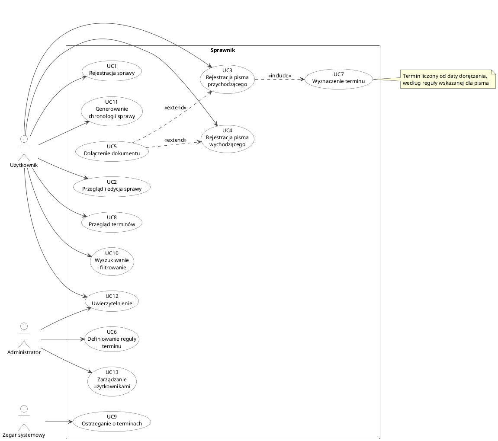
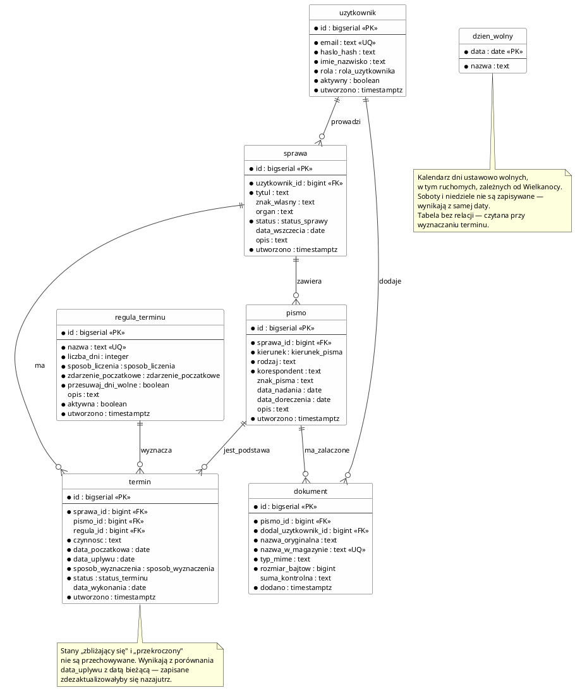
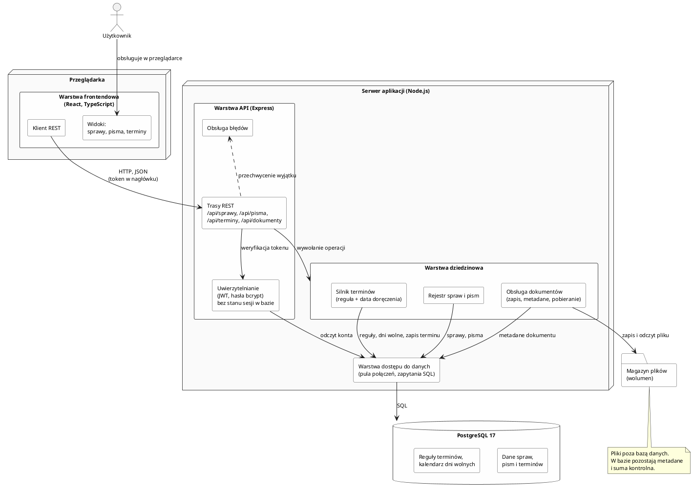

# 2. Kluczowe zagadnienia związane z realizacją projektu

<!-- Limit szablonu: 3-5 stron łącznie. Sekcja obejmuje przypadki użycia,
     model danych z diagramem ERD, architekturę z diagramem komponentów
     oraz kluczowe fragmenty implementacji. -->

## 2.1. Przypadki użycia

### Aktorzy

| Aktor | Opis |
|-------|------|
| **Użytkownik** | Osoba prowadząca sprawy — własne lub powierzone. Rejestruje sprawy i korespondencję, dołącza dokumenty, korzysta z wyznaczonych terminów i chronologii. |
| **Administrator** | Zarządza regułami wyznaczania terminów oraz kontami i uprawnieniami użytkowników. Reguły są danymi konfiguracyjnymi, więc ich definiowanie nie wymaga zmiany aplikacji. |
| **Zegar systemowy** | Aktor czasu. Cyklicznie uruchamia ocenę stanu terminów, dzięki czemu ostrzeżenie o terminie zbliżającym się lub przekroczonym powstaje bez udziału użytkownika. |

### Wykaz przypadków użycia

| ID | Przypadek użycia | Aktor | Funkcja |
|----|------------------|-------|---------|
| UC1 | Rejestracja sprawy | Użytkownik | F1 |
| UC2 | Przegląd i edycja sprawy | Użytkownik | F1 |
| UC3 | Rejestracja pisma przychodzącego | Użytkownik | F2 |
| UC4 | Rejestracja pisma wychodzącego | Użytkownik | F2 |
| UC5 | Dołączenie dokumentu | Użytkownik | F3 |
| UC6 | Definiowanie reguły terminu | Administrator | F4 |
| UC7 | Wyznaczenie terminu | *(zawierany przez UC3)* | F4 |
| UC8 | Przegląd terminów | Użytkownik | F5 |
| UC9 | Ostrzeganie o terminach | Zegar systemowy | F5 |
| UC10 | Wyszukiwanie i filtrowanie | Użytkownik | F6 |
| UC11 | Generowanie chronologii sprawy | Użytkownik | F7 |
| UC12 | Uwierzytelnienie | Użytkownik, Administrator | F8 |
| UC13 | Zarządzanie użytkownikami | Administrator | F8 |

Kolumna „Funkcja" odsyła do zakresu podstawowego F1–F8 uzgodnionego z promotorem.



*Rys. 1. Diagram przypadków użycia — zakres podstawowy.*

Dostęp do wszystkich przypadków użycia poza UC12 wymaga uwierzytelnienia.
Zależność ta nie została naniesiona na diagram jako trzynaście relacji
`«include»`, ponieważ zaciemniłaby obraz, nie wnosząc informacji.

### UC3 — Rejestracja pisma przychodzącego

Przypadek kluczowy dla całego systemu: to w nim powstaje termin, a więc
realizuje się główna teza projektu — że punktem odniesienia jest data
doręczenia, a nie data nadania.

**Aktor:** Użytkownik

**Warunek wstępny:** użytkownik uwierzytelniony, sprawa istnieje w systemie

**Przebieg główny**

1. Użytkownik wybiera sprawę i wskazuje rejestrację pisma przychodzącego.
2. Podaje nadawcę, znak pisma, rodzaj pisma oraz **datę nadania i datę doręczenia**
   jako dwie odrębne wartości.
3. Wskazuje regułę terminu właściwą dla czynności, której pismo dotyczy.
4. System zapisuje pismo i przypisuje je do sprawy.
5. System wyznacza termin (UC7) — relacja `«include»`, bo krok wykonuje się zawsze.
6. Wyznaczony termin pojawia się na liście terminów sprawy.

**Wynik:** pismo zarejestrowane, termin wyznaczony i widoczny w sprawie.

**Przebiegi alternatywne**

| Sytuacja | Zachowanie systemu |
|----------|--------------------|
| Data doręczenia nieznana | Pismo zostaje zapisane bez terminu i oznaczone jako oczekujące na potwierdzenie doręczenia. Termin powstaje dopiero po uzupełnieniu daty — system nie liczy terminu od daty nadania, bo byłoby to liczenie błędne. |
| Brak reguły dla danej czynności | Użytkownik wprowadza termin ręcznie; pozostaje on oznaczony jako wyznaczony ręcznie, nie automatycznie. |
| Dokument w postaci pliku | Krok opcjonalny — dołączenie dokumentu (UC5), relacja `«extend»`. |

### UC7 — Wyznaczenie terminu

**Aktor:** brak aktora bezpośredniego — przypadek zawierany przez UC3.

Reguła terminu jest zestawem danych, nie fragmentem kodu: określa nazwę,
liczbę dni, sposób ich liczenia oraz zdarzenie początkowe. Wyznaczenie terminu
polega na zastosowaniu reguły do daty doręczenia:

1. Odczytanie reguły wskazanej dla pisma.
2. Przyjęcie daty doręczenia jako punktu początkowego.
3. Dodanie liczby dni zgodnie ze sposobem liczenia zapisanym w regule
   (dni kalendarzowe albo robocze).
4. Przesunięcie terminu przypadającego na dzień wolny na najbliższy dzień
   roboczy — krokami naprzód, aż do dnia, który nie jest ani sobotą, ani
   niedzielą, ani dniem ustawowo wolnym.
5. Zapisanie terminu wraz z odniesieniem do pisma i reguły, na podstawie
   których powstał.

Krok 5 jest istotny dla wiarygodności systemu: przy każdym terminie zachowana
zostaje informacja, z jakiego pisma i jakiej reguły wynika, dzięki czemu
wyliczenie można odtworzyć i sprawdzić.

### UC9 — Ostrzeganie o terminach

**Aktor:** Zegar systemowy

Cykliczne przejrzenie terminów otwartych i zakwalifikowanie każdego z nich do
jednego ze stanów: odległy, zbliżający się, przekroczony. Progi są
konfigurowalne. Ostrzeżenie nie modyfikuje terminu — zmienia wyłącznie sposób
jego prezentacji użytkownikowi (UC8).

## 2.2. Model danych

Model obejmuje siedem tabel. Cztery odwzorowują przedmiot pracy (sprawa, pismo,
dokument, termin), jedna użytkowników, a dwie stanowią konfigurację mechanizmu
wyznaczania terminów (reguła terminu, kalendarz dni wolnych).

| Tabela | Rola w systemie |
|--------|-----------------|
| `uzytkownik` | Konta i role. Rozróżnienie użytkownika od administratora decyduje o dostępie do reguł terminów i zarządzania kontami. |
| `sprawa` | Jednostka nadrzędna. Grupuje korespondencję, dokumenty i terminy jednego postępowania. |
| `pismo` | Pojedyncza przesyłka przychodząca lub wychodząca. Nośnik dat, od których liczą się terminy. |
| `dokument` | Plik załączony do pisma wraz z metadanymi pozwalającymi zweryfikować jego tożsamość. |
| `regula_terminu` | Konfiguracja sposobu wyznaczania terminu. Dane, nie kod. |
| `termin` | Wyznaczony termin wraz ze śladem pochodzenia. |
| `dzien_wolny` | Kalendarz dni ustawowo wolnych, wykorzystywany przy liczeniu dni roboczych. |



*Rys. 2. Diagram związków encji (notacja Information Engineering).*

### Decyzje projektowe

**Data nadania i data doręczenia są osobnymi polami, a doręczenie może
pozostać nieznane.** To odwzorowanie głównego założenia projektu. Kolumna
`pismo.data_doreczenia` dopuszcza wartość pustą — pismo bywa zarejestrowane,
zanim potwierdzenie odbioru dotrze do prowadzącego sprawę. Dopóki pozostaje
pusta, termin nie powstaje. Alternatywą byłoby liczenie od daty nadania, ale
dawałoby to wynik systematycznie zaniżony, czyli błędny w sposób niebezpieczny
dla użytkownika.

**Reguła terminu jest wierszem w tabeli, nie gałęzią w kodzie.** Tabela
`regula_terminu` opisuje termin czterema cechami: liczbą dni, sposobem ich
liczenia, zdarzeniem początkowym oraz tym, czy termin przypadający na dzień
wolny przesuwa się na najbliższy roboczy. Dodanie nowej reguły jest operacją
na danych i nie wymaga zmiany aplikacji ani jej ponownego wdrożenia.

**Termin przechowuje ślad swojego pochodzenia.** Oprócz daty upływu zapisywane
są: pismo będące podstawą (`pismo_id`), zastosowana reguła (`regula_id`) oraz
data przyjęta za początek biegu (`data_poczatkowa`). Dzięki temu każde
wyliczenie można odtworzyć i sprawdzić, zamiast przyjmować wynik na wiarę.
Przy terminie wprowadzonym ręcznie oba odniesienia pozostają puste, a kolumna
`sposob_wyznaczenia` odróżnia go od wyznaczonego automatycznie.

**Stany „zbliżający się" i „przekroczony" nie są przechowywane.** Wynikają
z porównania `data_uplywu` z datą bieżącą i konfigurowalnym progiem ostrzegania.
Zapisane w bazie dezaktualizowałyby się nazajutrz i wymagałyby cyklicznego
przeliczania całej tabeli. Przechowywany jest wyłącznie `status` opisujący
decyzję użytkownika: termin otwarty, wykonany albo anulowany.

**Kalendarz dni wolnych jest osobną tabelą.** Bez niej pojęcia „dni robocze"
oraz „przesunięcie terminu z dnia wolnego" nie dają się zdefiniować.
`dzien_wolny` nie wchodzi w relacje z pozostałymi tabelami — jest czytana
w trakcie wyznaczania terminu.

Tabela przechowuje wyłącznie dni ustawowo wolne. Soboty i niedziele wynikają
z samej daty i nie są w niej zapisywane — przechowywanie ich byłoby
powielaniem informacji, którą data już niesie. Rozróżnienie to ma znaczenie
praktyczne, ponieważ część dni ustawowo wolnych jest ruchoma i zależy od daty
Wielkanocy, więc musi zostać wprowadzona do systemu jako dane.

**Dokument należy do pisma, a przez nie do sprawy.** Rozważono przypisanie
dokumentu bezpośrednio do sprawy, co pozwoliłoby przechowywać pliki niezwiązane
z żadną przesyłką. Odrzucono je, ponieważ rozmywałoby odpowiedź na pytanie,
czego dowodzi dany plik. Obok nazwy pierwotnej zapisywana jest nazwa w magazynie
oraz suma kontrolna, co pozwala wykryć podmianę pliku.

**Chronologia sprawy nie ma własnej tabeli.** Powstaje jako zapytanie łączące
pisma, terminy i dokumenty jednej sprawy, uporządkowane datą. Osobna tabela
zdarzeń dublowałaby dane już zapisane i wymagałaby utrzymywania ich w zgodzie.

### Termin przypadający na dzień wolny

Termin wyznaczony na sobotę, niedzielę lub dzień ustawowo wolny od pracy
przesuwa się na najbliższy następny dzień roboczy. Przesunięcie dotyczy
wyłącznie dnia końcowego — nie zmienia liczby dni zapisanej w regule ani
sposobu ich liczenia.

Istotne jest, że przesunięcie wykonuje się **powtarzalnie, aż do skutku**.
Pojedynczy krok naprzód nie wystarcza, ponieważ dzień następujący po dniu
wolnym bywa również wolny:

| Wyliczona data upływu | Dlaczego jest wolna | Termin ostateczny |
|------------------------|---------------------|-------------------|
| sobota | dzień tygodnia | poniedziałek |
| niedziela | dzień tygodnia | poniedziałek |
| 3 maja (środa) | dzień ustawowo wolny | czwartek 4 maja |
| Wielka Sobota | dzień tygodnia, po niej Niedziela i Poniedziałek Wielkanocny | wtorek po Wielkanocy |
| 25 grudnia | dzień ustawowo wolny, po nim 26 grudnia również | 27 grudnia albo pierwszy dzień roboczy po nim |
| 24 grudnia 2026 (czwartek) | Wigilia, Boże Narodzenie, drugi dzień świąt w sobotę i niedziela | poniedziałek 28 grudnia |

Dwa ostatnie wiersze pokazują, dlaczego zachowanie trzeba zapisać jako pętlę,
a nie jako przesunięcie o jeden dzień: między datą wyliczoną a terminem
ostatecznym potrafi leżeć kilka dni wolnych z rzędu.

Wielki Piątek nie występuje w zestawieniu, ponieważ w Polsce nie jest dniem
ustawowo wolnym od pracy — ciąg dni wolnych wokół Wielkanocy rozpoczyna się
dopiero w sobotę. Kalendarz systemu obejmuje czternaście dni ustawowo wolnych,
w tym 24 grudnia, wolne od 2025 roku na podstawie ustawy z 6 grudnia 2024 r.
o zmianie ustawy o dniach wolnych od pracy.

Zachowanie to sterowane jest kolumną `regula_terminu.przesuwaj_dni_wolne`.
Pozostaje konfigurowalne dla każdej reguły z osobna, ponieważ nie każdy termin
umowny musi mu podlegać, natomiast dla reguł odwzorowujących terminy ustawowe
przyjmuje wartość prawdziwą.

### Typy wyliczeniowe i ograniczenia

Zbiory wartości zamknięte z natury zapisano jako typy wyliczeniowe PostgreSQL:
`rola_uzytkownika`, `status_sprawy`, `kierunek_pisma`, `sposob_liczenia`,
`zdarzenie_poczatkowe`, `sposob_wyznaczenia`, `status_terminu`. Ogranicza to
zakres dopuszczalnych wartości na poziomie bazy, a nie wyłącznie aplikacji.

Spójność wspierają ograniczenia sprawdzające. Najistotniejsze z nich:

| Ograniczenie | Cel |
|--------------|-----|
| `data_doreczenia >= data_nadania` | Doręczenie nie może poprzedzać nadania. |
| `data_uplywu >= data_poczatkowa` | Termin nie może upływać przed rozpoczęciem biegu. |
| `liczba_dni > 0` | Reguła musi wyznaczać termin dodatni. |
| termin automatyczny wymaga `regula_id` i `pismo_id` | Wyliczenie bez podstawy nie jest odtwarzalne. |
| `data_wykonania` tylko przy statusie `wykonany` | Data wykonania bez wykonania jest sprzeczna. |

Usunięcie sprawy kasuje kaskadowo jej pisma, dokumenty i terminy, ponieważ
poza sprawą tracą one sens. Usunięcie reguły, do której odwołują się terminy,
jest blokowane — inaczej znikłaby podstawa wyliczeń już dokonanych.

## 2.3. Architektura aplikacji

System dzieli się na pięć warstw o rozdzielonych zadaniach. Podział przebiega
zarówno przez granicę procesu (przeglądarka, serwer aplikacji, serwer bazy),
jak i wewnątrz samej aplikacji serwerowej.



*Rys. 3. Diagram komponentów i zależności między nimi.*

| Warstwa | Zadanie | Nie odpowiada za |
|---------|---------|------------------|
| Frontendowa | Prezentacja i obsługa interakcji. Wyłącznie komunikacja z API. | Reguły wyznaczania terminów, dostęp do bazy. |
| API | Przyjęcie żądania, sprawdzenie uprawnień, walidacja danych wejściowych, zwrócenie odpowiedzi. | Logikę dziedzinową i SQL. |
| Uwierzytelnianie | Weryfikacja tożsamości i podpisanego tokenu. | Autoryzację operacji dziedzinowych. |
| Dziedzinowa | Wyznaczanie terminów, rejestr spraw i pism, obsługa dokumentów. | Protokół HTTP i format odpowiedzi. |
| Dostępu do danych | Pula połączeń i zapytania SQL. | Decyzje o treści danych. |

Zależności biegną wyłącznie w jedną stronę: od warstwy zewnętrznej ku bazie.
Warstwa dziedzinowa nie zna pojęcia żądania HTTP, a warstwa dostępu do danych
nie zna reguł terminów. Dzięki temu silnik terminów daje się sprawdzić testem
bez uruchamiania serwera, a wymiana sposobu prezentacji nie narusza reguł
wyliczeń.

### Rozdzielenie mechanizmu uwierzytelniania

Uwierzytelnianie stanowi odrębny komponent wywoływany przed obsługą żądania,
a nie fragment logiki tras. Hasła przechowywane są wyłącznie w postaci skrótu
z funkcją bcrypt; system nie dysponuje możliwością odtworzenia hasła.

Sesja jest bezstanowa — tożsamość potwierdza podpisany token przekazywany
w nagłówku żądania. W bazie nie powstaje tabela sesji. Rozwiązanie odciąża bazę
i upraszcza wdrożenie, ale ma świadomie przyjętą wadę: token pozostaje ważny do
czasu wygaśnięcia i nie da się go unieważnić pojedynczo bez dodatkowego rejestru
tokenów odwołanych. Dla systemu o zakresie demonstracyjnym jest to kompromis
akceptowalny; przy wdrożeniu produkcyjnym wymagałby uzupełnienia.

### Rozdzielenie obsługi dokumentów

Pliki przechowywane są poza bazą danych, na wolumenie systemu plików.
W bazie pozostają metadane: nazwa pierwotna, nazwa w magazynie, typ, rozmiar
i suma kontrolna. Rozważono zapis plików w bazie jako dane binarne — odrzucono
go, ponieważ powiększałby kopie zapasowe bazy o treść skanów i obciążał pulę
połączeń przesyłaniem dużych obiektów.

Rozdzielenie to wprowadza wymóg spójności między dwoma magazynami: usunięcie
dokumentu musi objąć zarówno wiersz, jak i plik. Suma kontrolna pozwala wykryć,
że plik w magazynie przestał odpowiadać opisowi w bazie.

### Odwzorowanie warstw w kodzie

Podział z diagramu odpowiada strukturze katalogów aplikacji serwerowej,
co pozwala odczytać architekturę wprost z repozytorium:

| Katalog | Warstwa |
|---------|---------|
| `backend/src/routes/` | API — trasy REST |
| `backend/src/middleware/` | uwierzytelnianie, obsługa błędów |
| `backend/src/services/` | warstwa dziedzinowa, w tym silnik terminów *(w budowie)* |
| `backend/src/db/` | dostęp do danych |
| `backend/src/config/` | konfiguracja ze zmiennych środowiskowych |
| `frontend/src/` | warstwa frontendowa |

Katalogi oznaczone jako będące w budowie powstają wraz z implementacją
kolejnych funkcji. Pozostałe istnieją w repozytorium w chwili przygotowania
niniejszego opisu.

### Uruchomienie

Baza danych pracuje w kontenerze opisanym w `docker-compose.yml`, co pozwala
odtworzyć środowisko jednym poleceniem i uniezależnia projekt od instalacji
PostgreSQL w systemie. Parametry połączenia, port oraz sekret podpisujący token
pochodzą ze zmiennych środowiskowych — plik `.env.example` zawiera ich wykaz
bez wartości rzeczywistych.

## 2.4. Kluczowe fragmenty implementacji

### Przesunięcie terminu na najbliższy dzień roboczy

Zachowanie opisane w punkcie 2.2 zapisane jest jako pętla, a nie jako
przesunięcie o jeden dzień. Dzień wolny rozpoznawany jest dwojako: sobota
i niedziela wynikają z samej daty, dni ustawowo wolne — z kalendarza w bazie.

```ts
export function czyDzienWolny(iso: string, kalendarz: Kalendarz): boolean {
  const dzienTygodnia = naDate(iso).getUTCDay();
  return dzienTygodnia === 0 || dzienTygodnia === 6 || kalendarz.has(iso);
}

export function najblizszyDzienRoboczy(iso: string, kalendarz: Kalendarz): string {
  let data = naDate(iso);
  while (czyDzienWolny(naIso(data), kalendarz)) {
    data = przesun(data, 1);
  }
  return naIso(data);
}
```

Silnik terminów nie odwołuje się do bazy danych ani do protokołu HTTP: przyjmuje
regułę, datę początkową i kalendarz jako argumenty. Dzięki temu sprawdzany jest
testem jednostkowym bez uruchamiania serwera — testy obejmują między innymi
przypadek czterech dni wolnych z rzędu na przełomie grudnia oraz dni wolne wokół
Wielkanocy.

Oprócz daty upływu zwracana jest data sprzed przesunięcia, dzięki czemu wynik
można prześledzić zamiast przyjmować go na wiarę.

### Powstanie terminu przy rejestracji pisma

Rejestracja pisma i wyznaczenie terminu to jedna operacja niepodzielna, bo UC3
zawiera UC7. Termin powstaje wyłącznie wtedy, gdy nastąpiło zdarzenie, od
którego biegnie:

```ts
const poczatek = dataBiegu(regula.zdarzeniePoczatkowe, pismo);
if (!poczatek) {
  return {
    pismo,
    termin: null,
    powodBrakuTerminu:
      'Pismo oczekuje na potwierdzenie doręczenia — termin powstanie po uzupełnieniu daty',
  };
}
```

Brak daty doręczenia nie jest więc błędem walidacji, lecz stanem przewidzianym:
pismo zapisuje się bez terminu wraz z wyjaśnieniem, a termin powstaje przy
uzupełnieniu daty. Alternatywa — przyjęcie daty nadania jako zastępczej —
dawałaby wynik systematycznie zaniżony.

### Odwzorowanie warstw w kodzie

Każda warstwa z diagramu komponentów ma w repozytorium osobny katalog
(`routes`, `middleware`, `services`, `db`), a zależności biegną wyłącznie
w jedną stronę. Trasa nie zawiera zapytań SQL, a moduł dziedzinowy nie zna
obiektu żądania. Uwierzytelnianie działa jako ogniwo uruchamiane przed obsługą
żądania, więc trasa chroniona nie może pominąć sprawdzenia tożsamości przez
przeoczenie.
