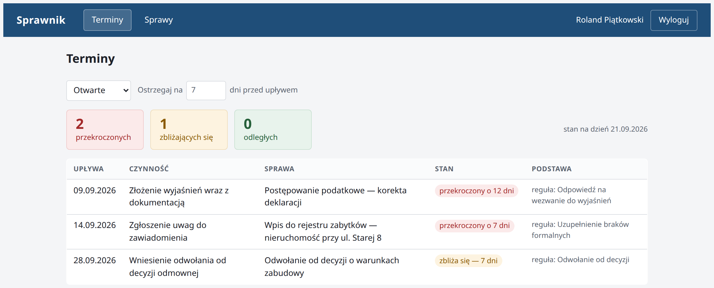
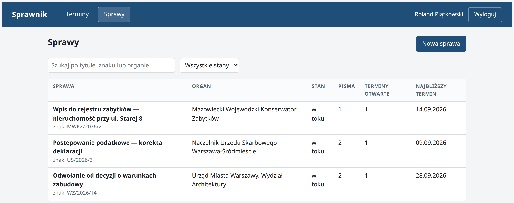
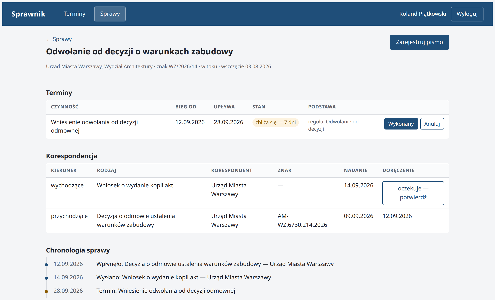
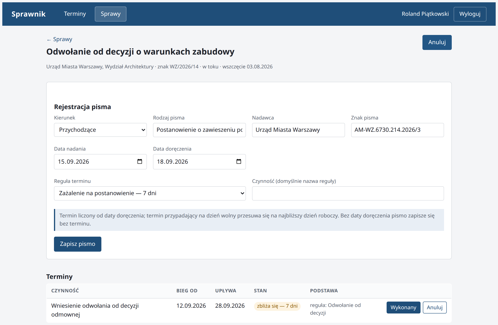

# 3. Zrzuty ekranu, wizualizacje

Zrzuty pochodzą z działającej aplikacji wypełnionej danymi demonstracyjnymi.
Wszystkie widoczne terminy zostały wyznaczone przez system na podstawie reguł
i dat doręczenia — żadnej z tych dat nie wpisano ręcznie.

{width=16cm}

*Rys. 4. Przegląd terminów ze wszystkich spraw. Stan terminu wyliczany jest przy
odczycie, przez porównanie daty upływu z datą bieżącą, a próg ostrzegania
pozostaje nastawialny. Stany odróżnia kolor oraz opis słowny, nie sam kolor.*

{width=16cm}

*Rys. 5. Rejestr spraw z wyszukiwaniem i filtrowaniem. Liczba pism, liczba
terminów otwartych i data najbliższego terminu powstają w jednym zapytaniu
do bazy.*

{width=16cm}

*Rys. 6. Widok sprawy: terminy wraz ze wskazaniem reguły, z której powstały,
korespondencja oraz chronologia. Pismo bez potwierdzonego doręczenia ma
w kolumnie „doręczenie" przycisk uzupełnienia daty — dopiero ta czynność
wyznacza termin.*

{width=16cm}

*Rys. 7. Rejestracja pisma przychodzącego (UC3). Data nadania i data doręczenia
są odrębnymi polami, a formularz uprzedza, że bez daty doręczenia pismo
zapisze się bez terminu.*
